# Lecture 4: Introduction to Reinforcement Learning
## Definitions
* $\pi_{\theta}\left(\mathbf{a}_{t} \mid \mathbf{o}_{t}\right)$ - policy (partially observed)
* $\pi_{\theta}\left(\mathbf{a}_{t} \mid \mathbf{s}_{t}\right)$ - policy (fully observed)
* **Markov Chain**: $\mathcal{M}=\{\mathcal{S}, \mathcal{T}\}$
    * 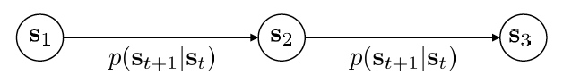
    * $\mathcal{S}$ - state space
    * $\mathcal{A}$ - action space
* **Markov Decision Process**: $\mathcal{M}=\{\mathcal{S}, \mathcal{A}, \mathcal{T}, r\}$
    * 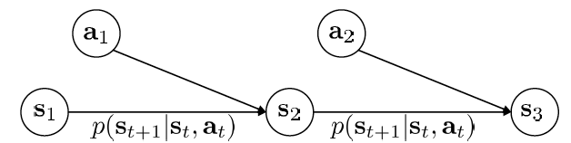
    * $\mathcal{T}$ - transition operator
    * $r$ - reward function: $r: \mathcal{S} \times \mathcal{A} \rightarrow \mathbb{R}$
* **partially observed Markov Decision Process**: $\mathcal{M}=\{\mathcal{S}, \mathcal{A}, \mathcal{O}, \mathcal{T}, \mathcal{E}, r\}$
    * 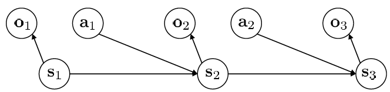
    * $\mathcal{O}$ - observation space
    * $\mathcal{E}$ - emission probability - $p(o_t \mid s_t )$
## RL objective
* $p_{\theta}(\tau) = p_{\theta}\left(\mathbf{s}_{1}, \mathbf{a}_{1}, \ldots, \mathbf{s}_{T}, \mathbf{a}_{T}\right)=p\left(\mathbf{s}_{1}\right) \prod_{t=1}^{T} \pi_{\theta}\left(\mathbf{a}_{t} \mid \mathbf{s}_{t}\right) p\left(\mathbf{s}_{t+1} \mid \mathbf{s}_{t}, \mathbf{a}_{t}\right)$
    * $\theta^{\star}=\arg \max\limits_{\theta} E_{\tau \sim p_{\theta}(\tau)}\left[\sum_{t} r\left(\mathbf{s}_{t}, \mathbf{a}_{t}\right)\right]$
* Markov Chain on $(\mathbf{s}, \mathbf{a})$ 
    * $p\left(\left(\mathbf{s}_{t+1}, \mathbf{a}_{t+1}\right) \mid\left(\mathbf{s}_{t}, \mathbf{a}_{t}\right)\right)= p\left(\mathbf{s}_{t+1} \mid \mathbf{s}_{t}, \mathbf{a}_{t}\right) \pi_{\theta}\left(\mathbf{a}_{t+1} \mid \mathbf{s}_{t+1}\right)$ 
    * 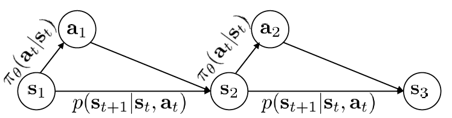
    * 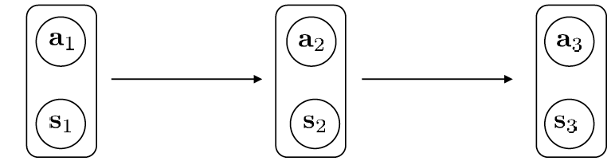
* **state-action marginal**: $p_{\theta}\left(\mathbf{s}_{t}, \mathbf{a}_{t}\right)$
* **finite horizon case**: $\theta^{\star} = \arg \max\limits_{\theta} E_{\tau \sim p_{\theta}(\tau)}\left[\sum_{t} r\left(\mathbf{s}_{t}, \mathbf{a}_{t}\right)\right] = \arg \max\limits_{\theta} \sum_{t=1}^{T} E_{\left(\mathbf{s}_{t}, \mathbf{a}_{t}\right) \sim p_{\theta}\left(\mathbf{s}_{t}, \mathbf{a}_{t}\right)}\left[r\left(\mathbf{s}_{t}, \mathbf{a}_{t}\right)\right]$
* **infinite horizon case**: $\theta^{\star} = \arg \max\limits_{\theta} E_{\tau \sim p_{\theta}(\tau)}\left[\sum_{t} r\left(\mathbf{s}_{t}, \mathbf{a}_{t}\right)\right] \to \arg \max\limits_{\theta} E_{\left(\mathbf{s}, \mathbf{a}\right) \sim p_{\theta}\left(\mathbf{s}, \mathbf{a}\right)}\left[r\left(\mathbf{s}, \mathbf{a}\right)\right]$ (in the limit as $T \to \infty$)
    * stationary distribution: $\mu = p_{\theta}\left(\mathbf{s}_{t}, \mathbf{a}_{t}\right)$
        * $\mu = \mathcal{T}\mu$ => $(\mathcal{T} - \mathbf{I})\mu = 0$ =>$\mu$ is eigenvector of $\mathcal{T}$ with eigenvalue $1$.
            * $\mathcal{T}$ is state-action trainsition operator
## RL Algorithms
* *Algorithm*:
    
    ```vhdl
    Repeat:
      Generate Samples (i.e. run the policy)
      fit a model / estimate the return
      improve the policy
    ```
    
* **Q-function**: $Q^{\pi}\left(\mathbf{s}_{t}, \mathbf{a}_{t}\right)=\sum_{t^{\prime}=t}^{T} E_{\pi_{\theta}}\left[r\left(\mathbf{s}_{t^{\prime}}, \mathbf{a}_{t^{\prime}}\right) \mid \mathbf{s}_{t}, \mathbf{a}_{t}\right]$
    
* **Value function**: $V^{\pi}\left(\mathbf{s}_{t}\right)=\sum_{t^{\prime}=t}^{T} E_{\pi_{\theta}}\left[r\left(\mathbf{s}_{t^{\prime}}, \mathbf{a}_{t^{\prime}}\right) \mid \mathbf{s}_{t}\right] = E_{\mathbf{a}_{t} \sim \pi\left(\mathbf{a}_{t} \mid \mathbf{s}_{t}\right)}\left[Q^{\pi}\left(\mathbf{s}_{t}, \mathbf{a}_{t}\right)\right]$
    
    * RL objective in terms of V: $E_{\mathbf{s} \sim p\left(\mathbf{s}\right)}\left[V^{\pi}\left(\mathbf{s}_{1}\right)\right]$
    
* _Key ideas_:
    * If we have policy $\pi$ and know $$Q^{\pi}\left(\mathbf{s}, \mathbf{a}\right)$, then we can improve the policy
    * compute gradient to increase probability od good action $\mathbf{a}$
        * if $$Q^{\pi}\left(\mathbf{s}, \mathbf{a}\right) > V^{\pi}\left(\mathbf{s}\right)$, then $\mathbf{a}$ is better than average => 
    
* _Types of RL algorithms_:
    * **Policy gradients**: directly differentiate the objective $\theta^{\star}=\arg \max\limits_{\theta} E_{\tau \sim p_{\theta}(\tau)}\left[\sum_{t} r\left(\mathbf{s}_{t}, \mathbf{a}_{t}\right)\right]$
        * eg. REINFORCE, Natural PG, Trust Region Policy Gradient (TRPO) 
    * **Value-based**: estimate V or Q function of the optimal policy (no explicit policy)
        * eg. Q-learning, DQN, TD Learning, Fitted Value Iteration
    * **Actor-Critic**: estimate V or Q function of the current policy, use it to improve policy
        * eg. Asynchronous advantage actor-critic (A3C), Soft actor critic (SAC)
    * **Model-based RL**: estimate the transition model, and then use it for planning (no explicit policy) or to improve a policy or something else.
        * eg. Dyna, Guided Policy Search
    
* Why so many RL algorithms?
    * Different tradeoffs
        * _Sample efficiency_
            * 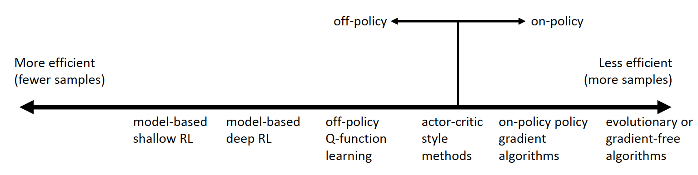
            * **off-policy vs on-policy** - for on-policy, will need to - new samples every time policy is changed.
            * don't forget the wall-clock time for each iteration.
        * _Stability & ease of use_ - convergence?
            * Value function fitting
                * At best, minimizes error of fit (“Bellman error”) - Not the same as expected reward
                * At worst, doesn’t optimize anything - Many popular deep RL value fitting algorithms are not guaranteed to converge to anything in the nonlinear case
            * Model based RL
                * Model minimizes error of fit - This will converge
                * No guarantee that better model = better policy
            * Policy gradient
                * The only one that actually performs SGD on the true objective
    * Different assumptions
        * Stochastic or deterministic?
        * Continuous or discrete?
        * Episodic or infinite horizon?
        * Common assumptions:
            * full observability
                * generally by value-function fitting methods
            * episodic learning 
                * often by pure PG methods 
                * some model-based RL methods
            * continuity or smoothness
                * some continuous value-function fitting methods
                * often by model-based RL methods
    * Different things are easy or hard in different settings
        * Easier to represent the policy?
        * Easier to represent the model?

# Lecture 5: Policy Gradients
## The policy gradient algorithm
* RL objective $\theta^{\star} = \arg \max\limits_{\theta} E_{\tau \sim p_{\theta}(\tau)}\left[\sum_{t} r\left(\mathbf{s}_{t}, \mathbf{a}_{t}\right)\right]$
    * finite-horizon: $\theta^{\star} = \arg \max\limits_{\theta} \sum_{t=1}^{T} E_{\left(\mathbf{s}_{t}, \mathbf{a}_{t}\right) \sim p_{\theta}\left(\mathbf{s}_{t}, \mathbf{a}_{t}\right)}\left[r\left(\mathbf{s}_{t}, \mathbf{a}_{t}\right)\right]$
    * infinite-horizon: $\theta^{\star} = \arg \max\limits_{\theta} E_{\left(\mathbf{s}, \mathbf{a}\right) \sim p_{\theta}\left(\mathbf{s}, \mathbf{a}\right)}\left[r\left(\mathbf{s}, \mathbf{a}\right)\right]$
* _episode reward_: $r(\tau) = \sum_{t} r\left(\mathbf{s}_{t}, \mathbf{a}_{t}\right)$
* _objective_: $J(\theta)= E_{\tau \sim p_{\theta}(\tau)}\left[r(\tau)\right] = E_{\tau \sim p_{\theta}(\tau)}\left[\sum_{t} r\left(\mathbf{s}_{t}, \mathbf{a}_{t}\right)\right]$
* _gradient_: $\nabla_{\theta} J(\theta)=E_{\tau \sim \pi_{\theta}(\tau)}\left[\nabla_{\theta} \log \pi_{\theta}(\tau) r(\tau)\right] = E_{\tau \sim \pi_{\theta}(\tau)}\left[\left(\sum_{t=1}^{T} \nabla_{\theta} \log \pi_{\theta}\left(\mathbf{a}_{t} \mid \mathbf{s}_{t}\right)\right)\left(\sum_{t=1}^{T} r\left(\mathbf{s}_{t}, \mathbf{a}_{t}\right)\right)\right]$
        * using log-derivative trick: $\nabla_{\theta} \pi_{\theta}(\tau)=\pi_{\theta}(\tau) \nabla_{\theta} \log \pi_{\theta}(\tau)$ 
        * also $\nabla_{\theta} \log \pi_{\theta}(\tau) = \sum_{t=1}^{T} \nabla_{\theta} \log \pi_{\theta}\left(\mathbf{a}_{t} \mid \mathbf{s}_{t}\right)$
* Sample to evaluate $J(\theta)$ and $\nabla_\theta J(\theta)$
    * $J(\theta) \approx \frac{1}{N} \sum_{i} r\left(\tau_i\right) = \frac{1}{N} \sum_{i} \sum_{t} r\left(\mathbf{s}_{i, t}, \mathbf{a}_{i, t}\right)$
    * $\nabla_{\theta} J(\theta) \approx \frac{1}{N} \sum_{i=1}^{N}\left(\nabla_{\theta} \log \pi_{\theta}(\tau_i) r(\tau_i)\right) = \frac{1}{N} \sum_{i=1}^{N}\left(\sum_{t=1}^{T} \nabla_{\theta} \log \pi_{\theta}\left(\mathbf{a}_{i, t} \mid \mathbf{s}_{i, t}\right)\right)\left(\sum_{t=1}^{T} r\left(\mathbf{s}_{i, t}, \mathbf{a}_{i, t}\right)\right)$
    * All expectations can be similarly evaluated!
* **REINFORCE**
        1. Repeat:
            1. sample $\left\{\tau^{i}\right\}$ from $\pi_{\theta}\left(\mathbf{a}_{t} \mid \mathbf{s}_{t}\right)$ (run the policy)
            2. $\nabla_{\theta} J(\theta) \approx \sum_{i}\left(\sum_{t} \nabla_{\theta} \log \pi_{\theta}\left(\mathbf{a}_{t}^{i} \mid \mathbf{s}_{t}^{i}\right)\right)\left(\sum_{t} r\left(\mathbf{s}_{t}^{i}, \mathbf{a}_{t}^{i}\right)\right)$
            3. $\theta \leftarrow \theta+\alpha \nabla_{\theta} J(\theta)$
 * _Policy Gradient v/s Maximum Likelihood (ML)_ 
     * PG: $\nabla_{\theta} J(\theta) \approx \frac{1}{N} \sum_{i=1}^{N}\left(\nabla_{\theta} \log \pi_{\theta}(\tau_i) r(\tau_i)\right) = \frac{1}{N} \sum_{i=1}^{N}\left(\sum_{t=1}^{T} \nabla_{\theta} \log \pi_{\theta}\left(\mathbf{a}_{i, t} \mid \mathbf{s}_{i, t}\right)\right)\left(\sum_{t=1}^{T} r\left(\mathbf{s}_{i, t}, \mathbf{a}_{i, t}\right)\right)$
     * ML: $\nabla_{\theta} J(\theta) \approx \frac{1}{N} \sum_{i=1}^{N}\left(\nabla_{\theta} \log \pi_{\theta}(\tau_i) \right) = \frac{1}{N} \sum_{i=1}^{N}\left(\sum_{t=1}^{T} \nabla_{\theta} \log \pi_{\theta}\left(\mathbf{a}_{i, t} \mid \mathbf{s}_{i, t}\right)\right)$
     * basically good stuff made more likely and bad stuff less.
 * _Partial Observability_ -> simply replace $\pi_{\theta}\left(\mathbf{a}_{t} \mid \mathbf{s}_{t}\right)$  with $\pi_{\theta}\left(\mathbf{a}_{t} \mid \mathbf{o}_{t}\right)$
     * $\nabla_{\theta} J(\theta) \approx \frac{1}{N} \sum_{i=1}^{N}\left(\sum_{t=1}^{T} \nabla_{\theta} \log \pi_{\theta}\left(\mathbf{a}_{i, t} \mid \mathbf{o}_{i, t}\right)\right)\left(\sum_{t=1}^{T} r\left(\mathbf{s}_{i, t}, \mathbf{a}_{i, t}\right)\right)$
     * works as we never used the Markov property!
 * problem: _High Variance_
## Basic Variance Reduction
* **Causality**: policy at time $t'$ cannot affect reward at time $t < t'$
    * Let $\hat{Q}_{i,t} = \sum_{t'=t}^{T} r\left(\mathbf{s}_{i, t'}, \mathbf{a}_{i, t'}\right)$
    * $\nabla_{\theta} J(\theta) \approx \frac{1}{N} \sum_{i=1}^{N}\left(\sum_{t=1}^{T} \nabla_{\theta} \log \pi_{\theta}\left(\mathbf{a}_{i, t} \mid \mathbf{s}_{i, t}\right)\right)\left(\sum_{t=1}^{T} r\left(\mathbf{s}_{i, t}, \mathbf{a}_{i, t}\right)\right) = \frac{1}{N} \sum_{i=1}^{N} \sum_{t=1}^{T} \nabla_{\theta} \log \pi_{\theta}\left(\mathbf{a}_{i, t} \mid \mathbf{s}_{i, t}\right) \hat{Q}_{i,t}$
* **Baselines**
    * Use $\nabla_{\theta} J(\theta) \approx \frac{1}{N} \sum_{i=1}^{N}\left(\nabla_{\theta} \log \pi_{\theta}(\tau_i) \left(r(\tau_i) - b\right)\right)$
    * subtracting baselines is unbiased in expectation: $E\left[\nabla_{\theta} \log \pi_{\theta}(\tau) b\right]=0$
    * potential baselines:
        * $b = \frac{1}{N}\sum_{i=1}^{N} r(\tau)$ - _average reward_
        * $b=\frac{E\left[g(\tau)^{2} r(\tau)\right]}{E\left[g(\tau)^{2}\right]}$ - _optimal baseline_ that minimizes variance $Var_{\tau \sim p_{\theta}(\tau)}[g(\tau) (r(\tau) - b)]$ 
            * $g(\tau) = \nabla_{\theta} \log \pi_{\theta}\left(\tau\right)$
## Off-policy Learning using Importance Sampling
* PG is on-policy
* **Importance sampling (IS)**: $E_{x \sim p(x)}[f(x)] =\int p(x) f(x) dx = E_{x \sim q(x)}\left[\frac{p(x)}{q(x)} f(x)\right]$
* Using IS, $J(\theta)=E_{\tau \sim \bar{\pi}(\tau)}\left[\frac{\pi_{\theta}(\tau)}{\bar{\pi}(\tau)} r(\tau)\right]$
    * where $\frac{\pi_{\theta}(\tau)}{\bar{\pi}(\tau)}=\frac{p(\mathbf{s}_{1}) \prod_{t=1}^{T} \pi_{\theta}\left(\mathbf{a}_{t} \mid \mathbf{s}_{t}\right) p\left(\mathbf{s}_{t+1} \mid \mathbf{s}_{t}, \mathbf{a}_{t}\right)}{p\left(\mathbf{s}_{1}\right) \prod_{t=1}^{T} \bar{\pi}\left(\mathbf{a}_{t} \mid \mathbf{s}_{t}\right) p\left(\mathbf{s}_{t+1} \mid \mathbf{s}_{t}, \mathbf{a}_{t}\right)} = \frac{\prod_{t=1}^{T} \pi_{\theta}\left(\mathbf{a}_{t} \mid \mathbf{s}_{t}\right)}{\prod_{t=1}^{T} \bar{\pi}\left(\mathbf{a}_{t} \mid \mathbf{s}_{t}\right)}$
* To estimate value at some _new_ parameters $\theta'$
    * $J(\theta')=E_{\tau \sim \pi_\theta(\tau)}\left[\frac{\pi_{\theta'}(\tau)}{\pi_\theta(\tau)} r(\tau)\right]$
    * $\nabla_{\theta^{\prime}} J\left(\theta^{\prime}\right)=E_{\tau \sim \pi_{\theta}(\tau)}\left[\frac{\pi_{\theta^{\prime}}(\tau)}{\pi_{\theta}(\tau)} \nabla_{\theta^{\prime}} \log \pi_{\theta^{\prime}}(\tau) r(\tau)\right]$
    * problem: Exponential scaling in $T$
    * solution 1: 
    * solution 2: apply IS to state action marginal $(\mathbf{s}_{i,t}, \mathbf{a}_{i,t}) \sim \pi_\theta(\mathbf{s}_t, \mathbf{a}_t)$ and ignore state portion
        * on-policy PG: $\nabla_{\theta^{\prime}} J\left(\theta^{\prime}\right) \approx \frac{1}{N} \sum_{i=1}^{N} \sum_{t=1}^{T} \nabla_{\theta} \log \pi_{\theta}\left(\mathbf{a}_{i, t} \mid \mathbf{s}_{i, t}\right) \hat{Q}_{i, t}$
        * off-policy PG: $\nabla_{\theta^{\prime}} J\left(\theta^{\prime}\right) \approx \frac{1}{N} \sum_{i=1}^{N} \sum_{t=1}^{T} \frac{\pi_{\theta^{\prime}}\left(\mathbf{s}_{i, t}, \mathbf{a}_{i, t}\right)}{\pi_{\theta}\left(\mathbf{s}_{i, t}, \mathbf{a}_{i, t}\right)} \nabla_{\theta^{\prime}} \log \pi_{\theta^{\prime}}\left(\mathbf{a}_{i, t} \mid \mathbf{s}_{i, t}\right) \hat{Q}_{i, t}$
            * Apply bayes rule and ignore the state portion
                * $\nabla_{\theta^{\prime}} J\left(\theta^{\prime}\right) \approx \frac{1}{N} \sum_{i=1}^{N} \sum_{t=1}^{T} \frac{\pi_{\theta^{\prime}}\left(\mathbf{a}_{i, t} \mid \mathbf{s}_{i, t}\right)}{\pi_{\theta}\left(\mathbf{a}_{i, t} \mid \mathbf{s}_{i, t}\right)} \nabla_{\theta^{\prime}} \log \pi_{\theta^{\prime}}\left(\mathbf{a}_{i, t} \mid \mathbf{s}_{i, t}\right) \hat{Q}_{i, t}$

## Pseudocode (with discrete actions)
### Maximum Likelihood
```python
# Given:
# actions --(N*T) x Da tensor of actions
# states --(N*T) x Ds tensor of states
# Build the graph:
logits = policy.predictions(states) # This should return (N*T) x Da tensor of action logits
negative_likelihoods = tf.nn.softmax_cross_entropy_with_logits(labels=actions, logits=logits)
loss = tf.reduce_mean(negative_likelihoods)
gradients = loss.gradients(loss, variables)
```
### Policy Gradients
```python
# Given:
# actions --(N*T) x Da tensor of actions
# states --(N*T) x Ds tensor of states
# q_values ––(N*T) x 1 tensor of estimated state action values (reward to go Q_t)
# Build the graph:
logits = policy.predictions(states) # This should return (N*T) x Da tensor of action logits
negative_likelihoods = tf.nn.softmax_cross_entropy_with_logits(labels=actions, logits=logits)
weighted_negative_likelihoods = tf.multiply(negative_likelihoods, q_values)
loss = tf.reduce_mean(weighted_negative_likelihoods)
gradients = loss.gradients(loss, variables)
```
## Practical Considerations
- remember that gradient has high variance and will be noisy
- use larger batch size
- learning rates, optimizers

# Lecture 6: Actor-Critic Algorithms
* $\nabla_{\theta} J(\theta) \approx \frac{1}{N} \sum_{i=1}^{N} \sum_{t=1}^{T} \nabla_{\theta} \log \pi_{\theta}\left(\mathbf{a}_{i, t} \mid \mathbf{s}_{i, t}\right) \hat{Q}_{i,t}^\pi$ has high variance
    * lower variance will allow **bigger steps** and **faster learning**.
* $\hat{Q}_{i,t} = \sum_{t'=t}^{T} r\left(\mathbf{s}_{i, t'}, \mathbf{a}_{i, t'}\right)$ is **single-sample** estimate of expected reward for taking $\mathbf{a}_{i,t}$ at $\mathbf{s}_{i,t}$ ("reward to go")
    * _unbiased but high variance_
* **state-action value function**: $Q^\pi \left(\mathrm{s}_{t}, \mathbf{a}_{t}\right) = \sum_{t^{\prime}=t}^{T} E_{\pi_{\theta}}\left[r\left(\mathbf{s}_{t^{\prime}}, \mathbf{a}_{t^{\prime}}\right) \mid \mathbf{s}_{t}, \mathbf{a}_{t}\right]$ - true _expected_ reward-to-go
* **state value function**: $V^\pi \left(\mathbf{s}_{t}\right) = \sum_{t^{\prime}=t}^{T} E_{\pi_{\theta}}\left[r\left(\mathbf{s}_{t^{\prime}}, \mathbf{a}_{t^{\prime}}\right) \mid \mathbf{s}_{t}\right] = E_{\mathbf{a}_{t} \sim \pi_{\theta}\left(\mathbf{a}_{t} \mid \mathbf{s}_{t}\right)}\left[Q^\pi \left(\mathbf{s}_{t}, \mathbf{a}_{t}\right)\right]$ - total reward from $\mathbf{s}_t$
* **advantage**: $A^\pi \left(\mathrm{s}_{t}, \mathbf{a}_{t}\right) = Q^\pi \left(\mathrm{s}_{t}, \mathbf{a}_{t}\right) - V^\pi \left(\mathbf{s}_{t}\right)$ - how much better than average $\mathbf{a}_t$ is
* $\nabla_{\theta} J(\theta) \approx \frac{1}{N} \sum_{i=1}^{N} \sum_{t=1}^{T} \nabla_{\theta} \log \pi_{\theta}\left(\mathbf{a}_{i, t} \mid \mathbf{s}_{i, t}\right) A^\pi \left(\mathbf{s}_{i, t}, \mathbf{a}_{i, t}\right)$
    * _biased but lower vairance_
        * Using a lower variance "reward-to-go" and a state-dependent baseline $V\left(\mathbf{s}_{t}\right)$
    * better the estimate $A^\pi \left(\mathrm{s}_{t}, \mathbf{a}_{t}\right)$, lower the variance -> usually use an approximation
## Value-Function fitting
* What to fit - Q, V or A?
    * Tradeoff: Can get V and A from Q but it depends on both s and a.
* $Q^{\pi}\left(\mathbf{s}_{t}, \mathbf{a}_{t}\right)=r\left(\mathbf{s}_{t}, \mathbf{a}_{t}\right)+\sum_{t^{\prime}=t+1}^{T} E_{\pi_{\theta}}\left[r\left(\mathbf{s}_{t^{\prime}}, \mathbf{a}_{t^{\prime}}\right) \mid \mathbf{s}_{t}, \mathbf{a}_{t}\right]=r\left(\mathbf{s}_{t}, \mathbf{a}_{t}\right)+E_{\mathbf{s}_{t+1} \sim p\left(\mathbf{s}_{t+1} \mid \mathbf{s}_{t}, \mathbf{a}_{t}\right)}\left[V^{\pi}\left(\mathbf{s}_{t+1}\right)\right]$
* Use a single sample estimate for second part (unbiased)
    * $Q^{\pi}\left(\mathbf{s}_{t}, \mathbf{a}_{t}\right) \approx r\left(\mathbf{s}_{t}, \mathbf{a}_{t}\right)+V^{\pi}\left(\mathbf{s}_{t+1}\right)$
    * $A^{\pi}\left(\mathbf{s}_{t}, \mathbf{a}_{t}\right) \approx r\left(\mathbf{s}_{t}, \mathbf{a}_{t}\right)+V^{\pi}\left(\mathbf{s}_{t+1}\right) -  V^\pi \left(\mathbf{s}_{t}\right)$
    * Can now fit only $V$! => don't need to fit a function approximator that takes both state and action
## Policy Evaluation
* Policy evaluation - Fitting value function to policy
    * $V^{\pi}\left(\mathbf{s}_{t}\right) = \sum_{t^{\prime}=t}^{T} E_{\pi_{\theta}}\left[r\left(\mathbf{s}_{t^{\prime}}, \mathbf{a}_{t^{\prime}}\right) \mid \mathbf{s}_{t}\right]$
    * $J(\theta) = E_{\mathbf{s}_{1} \sim p\left(\mathbf{s}_{1}\right)}\left[V^{\pi}\left(\mathbf{s}_{1}\right)\right]$
* Estimate $V^\pi$?
    * $V^{\pi}\left(\mathbf{s}_{t}\right) \approx \frac{1}{N} \sum_{i=1}^{N} \sum_{t^{\prime}=t}^{T} r\left(\mathbf{s}_{t^{\prime}}, \mathbf{a}_{t^{\prime}}\right)$ - requires resetting the simulator to $\mathbf{s}_t$
    * $V^{\pi}\left(\mathbf{s}_{t}\right) \approx \sum_{t^{\prime}=t}^{T} r\left(\mathbf{s}_{t^{\prime}}, \mathbf{a}_{t^{\prime}}\right)$ - single sample estimate - **Monte Carlo target** 
        * unbiased but higher variance
        * but still works because the same function approximator (NN) is fitted for all states => needs to generalize and some sharing happens between similar states.
        * 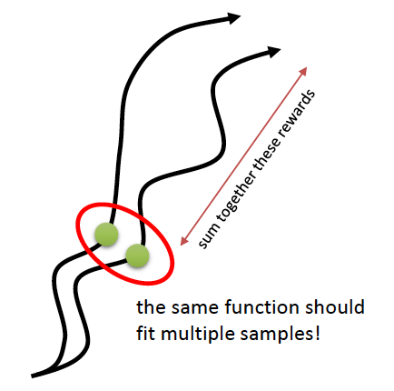
        * **Monte Carlo Evaluation** 
            * $V^{\pi}\left(\mathbf{s}_{t}\right) \approx \sum_{t^{\prime}=t}^{T} r\left(\mathbf{s}_{t^{\prime}}, \mathbf{a}_{t^{\prime}}\right)$
            * training data: $\left\{\left(\mathbf{s}_{i, t}, y_{i, t}\right)\right\}$ where $y_{i, t} = \sum_{t^{\prime}=t}^{T} r\left(\mathbf{s}_{i, t^{\prime}}, \mathbf{a}_{i, t^{\prime}}\right)$
            * supervised regression: $\mathcal{L}(\phi)=\frac{1}{2} \sum_{i}\left\|\hat{V}_{\phi}^{\pi}\left(\mathbf{s}_{i}\right)-y_{i}\right\|^{2}$
    * $y_{i, t} \approx r\left(\mathbf{s}_{i, t}, \mathbf{a}_{i, t}\right)+\hat{V}_{\phi}^{\pi}\left(\mathbf{s}_{i, t+1}\right)$ : **Bootstrapped Target** or **TD Target**
        * Approximate the reward after current timestep using the fitted value function $V^\pi$ from the previous training iteration
        * Biased because
            * the critic is not perfect (not fitted yet)
            * plus used the previous critic
        * But **lower variance** and likely better

## Discount Factors
* $y_{i, t} \approx r\left(\mathbf{s}_{i, t}, \mathbf{a}_{i, t}\right)+\gamma \hat{V}_{\phi}^{\pi}\left(\mathbf{s}_{i, t+1}\right)$ -> better to get rewards sooner rather than later
    * Useful for infinite horizon problems -> infinite summation
    * Also useful for finite horizon problems as if rewards are always positive -> $V^\pi$ will keep getting bigger
    * changes the MDP -> add a _death state_
    * 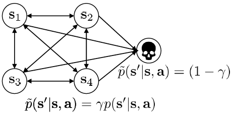
* Monte Carlo policy gradients with discount factors
    * option 1: $\nabla_{\theta} J(\theta) \approx \frac{1}{N} \sum_{i=1}^{N} \sum_{t=1}^{T} \nabla_{\theta} \log \pi_{\theta}\left(\mathbf{a}_{i, t} \mid \mathbf{s}_{i, t}\right)\left(\sum_{t^{\prime}=t}^{T} \gamma^{t^{\prime}-t} r\left(\mathbf{s}_{i, t^{\prime}}, \mathbf{a}_{i, t^{\prime}}\right)\right)$
    * option 2: $\nabla_{\theta} J(\theta) \approx \frac{1}{N} \sum_{i=1}^{N} \sum_{t=1}^{T} \gamma^{t-1} \nabla_{\theta} \log \pi_{\theta}\left(\mathbf{a}_{i, t} \mid \mathbf{s}_{i, t}\right)\left(\sum_{t=t}^{T} \gamma^{t^{\prime}-t} r\left(\mathbf{s}_{i, t^{\prime}}, \mathbf{a}_{i, t^{\prime}}\right)\right)$
        * later steps contribute less to the gradient and hence matter less
        * correct formulation for the MDP with deadth state
    * option 1 is used in practice
        * with critic: $\nabla_{\theta} J(\theta) \approx \frac{1}{N} \sum_{i=1}^{N} \sum_{t=1}^{T} \nabla_{\theta} \log \pi_{\theta}\left(\mathbf{a}_{i, t} \mid \mathbf{s}_{i, t}\right)\left(r\left(\mathbf{s}_{i, t}, \mathbf{a}_{i, t}\right)+\gamma \hat{V}_{\phi}^{\pi}\left(\mathbf{s}_{i, t+1}\right)-\hat{V}_{\phi}^{\pi}\left(\mathbf{s}_{i, t}\right)\right)$ 
        * the larger the summation, the higher the variance
        * $\gamma$ allows to tradeoff bias and variance
        * $\gamma$ allows an approximation to truly _infinite horizon average reward formulation_ (one without a death state) while avoiding the infinite sums (returns).
        * refer: [Bias in natural actor-critic algorithms](https://people.cs.umass.edu/~pthomas/papers/Thomas2014b.pdf) 

## Actor-Critic Algorithm (with discount)
* **Batch Actor-Critic Algorithm**:
        1. Repeat: 
            1. sample $\left\{\mathbf{s}_{i}, \mathbf{a}_{i}\right\}$ from $\pi_{\theta}(\mathbf{a} \mid \mathbf{s})$ (run it on the robot)
            2. fit $\hat{V}_{\delta}^{\pi}(\mathbf{s})$ to sampled reward sums
            3. evaluate $\hat{A}^{\pi}\left(\mathbf{s}_{i}, \mathbf{a}_{i}\right)=r\left(\mathbf{s}_{i}, \mathbf{a}_{i}\right)+\gamma\hat{V}_{\phi}^{\pi}\left(\mathbf{s}_{i}^{\prime}\right)-\hat{V}_{\phi}^{\pi}\left(\mathbf{s}_{i}\right)$
            4. $\nabla_{\theta} J(\theta) \approx \sum_{i} \nabla_{\theta} \log \pi_{\theta}\left(\mathbf{a}_{i} \mid \mathbf{s}_{i}\right) \hat{A}^{\pi}\left(\mathbf{s}_{i}, \mathbf{a}_{i}\right)$
            5. $\theta \leftarrow \theta+\alpha \nabla_{\theta} J(\theta)$
* **Online Actor-Critic Algorithm:**
        1. Repeat: 
            1. take action $\mathbf{a} \sim \pi_{\theta}(\mathbf{a} \mid \mathbf{s}),$ get $\left(\mathbf{s}, \mathbf{a}, \mathbf{s}^{\prime}, r\right)$
            2. update $\hat{V}_{\phi}^{\pi}$ using target $r+\gamma \hat{V}_{\phi}^{\pi}\left(\mathbf{s}^{\prime}\right)$
            3. evaluate $\hat{A}^{\pi}(\mathbf{s}, \mathbf{a})=r(\mathbf{s}, \mathbf{a})+\gamma \hat{V}_{\phi}^{\pi}\left(\mathbf{s}^{\prime}\right)-\hat{V}_{\phi}^{\pi}(\mathbf{s})$
            4. $\nabla_{\theta} J(\theta) \approx \nabla_{\theta} \log \pi_{\theta}(\mathbf{a} \mid \mathbf{s}) \hat{A}^{\pi}(\mathbf{s}, \mathbf{a})$
            5. $\theta \leftarrow \theta+\alpha \nabla_{\theta} J(\theta)$
  * Architecture?
    * Two network design: One each for $\hat{V}_{\phi}^{\pi}\left(\mathbf{s}^{\prime}\right)$ and $\pi_{\theta}(\mathbf{a} \mid \mathbf{s})$
        * simple and stable but no shared features
    * Shared network design
        * shared features but need to take care of gradients for shared part
* Online Actor-Critic in practice
    * single sample batch is bad (too high variance) - want larger batch size 
    * **synchronized parallel actor-critic**
        * synchronisation at the end of each iteration
    * **asynchronous parallel actor-critic**
        * use a parameter server
        * easier to implement as no need to synchronise
        * used in practice
* Critics as state-dependent baselines
    * Actor-Critic: $\nabla_{\theta} J(\theta) \approx \frac{1}{N} \sum_{i=1}^{N} \sum_{t=1}^{T} \nabla_{\theta} \log \pi_{\theta}\left(\mathbf{a}_{i, t} \mid \mathbf{s}_{i, t}\right)\left(r\left(\mathbf{s}_{i, t}, \mathbf{a}_{i, t}\right)+\gamma \hat{V}_{\phi}^{\pi}\left(\mathbf{s}_{i, t+1}\right)-\hat{V}_{\phi}^{\pi}\left(\mathbf{s}_{i, t}\right)\right)$
        * lowest variance but biased
    * Policy Gradient: $\nabla_{\theta} J(\theta) \approx \frac{1}{N} \sum_{i=1}^{N} \sum_{t=1}^{T} \nabla_{\theta} \log \pi_{\theta}\left(\mathbf{a}_{i, t} \mid \mathbf{s}_{i, t}\right)\left(\left(\sum_{t^{\prime}=t}^{T} \gamma^{t^{\prime}-t} r\left(\mathbf{s}_{i, t^{\prime}}, \mathbf{a}_{i, t^{\prime}}\right)\right)-b\right)$
        * unbiased but higher variance (because single sample estimate)
    * middle ground: $\nabla_{\theta} J(\theta) \approx \frac{1}{N} \sum_{i=1}^{N} \sum_{t=1}^{T} \nabla_{\theta} \log \pi_{\theta}\left(\mathbf{a}_{i, t} \mid \mathbf{s}_{i, t}\right)\left(\left(\sum_{t^{\prime}=t}^{T} \gamma^{t^{\prime}-t} r\left(\mathbf{s}_{i, t^{\prime}}, \mathbf{a}_{i, t^{\prime}}\right)\right)-\hat{V}_{\phi}^{\pi}\left(\mathbf{s}_{i, t}\right)\right)$
        * unbiased and lower variance than PG (baseline $V^\pi$ is closer to rewards)
* **Control Variates**: action-dependent baselines
    * $\hat{A}^{\pi}\left(\mathbf{s}_{t}, \mathbf{a}_{t}\right)=\sum_{t^{\prime}=t}^{\infty} \gamma^{t^{\prime}-t} r\left(\mathbf{s}_{t^{\prime}}, \mathbf{a}_{t^{\prime}}\right)-Q_{\phi}^{\pi}\left(\mathbf{s}_{t}, \mathbf{a}_{t}\right) \quad$
        * not correct - goes to zero in expectation if critic is correct!
    * $\nabla_{\theta} J(\theta) \approx \frac{1}{N} \sum_{i=1}^{N} \sum_{t=1}^{T} \nabla_{\theta} \log \pi_{\theta}\left(\mathbf{a}_{i, t} \mid \mathbf{s}_{i, t}\right)\left(\hat{Q}_{i, t}-Q_{\phi}^{\pi}\left(\mathbf{s}_{i, t}, \mathbf{a}_{i, t}\right)\right)+\frac{1}{N} \sum_{i=1}^{N} \sum_{t=1}^{T} \nabla_{\theta} E_{\mathbf{a} \sim \pi_{\theta}\left(\mathbf{a}_{t} \mid \mathbf{s}_{i, t}\right)}\left[Q_{\phi}^{\pi}\left(\mathbf{s}_{i, t}, \mathbf{a}_{t}\right)\right]$
        * Added an additional expectation term 
            * was zero for baseline and state-dependent baseline
        * Should be possible to compute the expectation analytically as intractable to do so using samples
            * Eg. multivariate normal policy and $Q$ quadratic in $\mathbf{a}$
        * Leads to even lower variance than using  $V^\pi$ as baseline (and still unbiased).
* **Multi-Step Returns**
    * Bootstrapped target has lower variance but higher bias if value is wrong (it always is)
    * Monte Carlo target has no bias but much higher variacne (single sample estimarte)
    * $\hat{A}_{n}^{\pi}\left(\mathbf{s}_{t}, \mathbf{a}_{t}\right)=\sum_{t^{\prime}=t}^{t+n} \gamma^{t^{\prime}-t} r\left(\mathbf{s}_{t^{\prime}}, \mathbf{a}_{t^{\prime}}\right) + \gamma^{n} \hat{V}_{\phi}^{\pi}\left(\mathbf{s}_{t+n}\right) - \hat{V}_{\phi}^{\pi}\left(\mathbf{s}_{t}\right)$
        * Use n-step returns where n is small enough to avoid high variance.
        * lower variance as  $\gamma^{n} \hat{V}_{\phi}^{\pi}\left(\mathbf{s}_{t+n}\right)$ becomes more heavily discounted as $n \to \infty$.
        * Combines the best of bootstrapped target and monte-carlo target.
    * [**Generalised Advantage Estimation**](https://arxiv.org/abs/1506.02438)
        * $\hat{A}_{\mathrm{GAE}}^{\pi}\left(\mathbf{s}_{t}, \mathbf{a}_{t}\right)=\sum_{n=1}^{\infty} w_{n} \hat{A}_{n}^{\pi}\left(\mathbf{s}_{t}, \mathbf{a}_{t}\right)$ - Weighted combination of n-step returns
            * With $w_{n} = (1 - \lambda)\lambda^{n-1}$ - exponential falloff - prefer cutting earlier (less variance)
            * $\hat{A}_{\mathrm{GAE}}^{\pi}\left(\mathbf{s}_{t}, \mathbf{a}_{t}\right)=\sum_{t^{\prime}=t}^{\infty}(\gamma \lambda)^{t^{\prime}-t} \delta_{t^{\prime}}$ where $\delta_{t^{\prime}}=r\left(\mathbf{s}_{t^{\prime}}, \mathbf{a}_{t^{\prime}}\right)+\gamma \hat{V}_{\phi}^{\pi}\left(\mathbf{s}_{t^{\prime}+1}\right)-\hat{V}_{\phi}^{\pi}\left(\mathbf{s}_{t^{\prime}}\right)$
                * $\lambda$ has similar effect to $\gamma$ - variance reduction
                * $\lambda = 0$ gives advantage with bootstrapped target
                * $\lambda = 1$ gives advantage with monte-carlo target
                * $0< \lambda <1$ makes a compromise between bias and variance

## Papers
* Classic papers
    * Sutton, McAllester , Singh, Mansour (1999). Policy gradient methods for reinforcement learning with function approximation: actor critic algorithms with value function approximation
* Deep reinforcement learning actor critic papers
    * Mnih , Badia , Mirza, Graves, Lillicrap , Harley, Silver, Kavukcuoglu (2016). Asynchronous methods for deep reinforcement learning: A3C parallel online actor critic
    * Schulman, Moritz, L., Jordan, Abbeel (2016). High dimensional continuous control using generalized advantage estimation: batch mode actor critic with blended Monte Carlo and function approximator returns
    * Gu, Lillicrap , Ghahramani , Turner, L. (2017). Q Prop: sample efficient policy gradient with an off policy critic: policy gradient with Q function control variate

# Lecture 7: Value Function Methods
## Value-based Methods
* High Level **Policy Iteration Algorithm**
            1. Repeat:
                1. evaluate $A^{\pi}(\mathbf{s}, \mathbf{a})$ or $V^{\pi}(\mathbf{s}, \mathbf{a})$ <- fit a model
                2. set $\pi \leftarrow \pi^{\prime}$	<- improve implicit policy
* Policy Evaluation using Dynamic Programming (DP)
    * bootstrapped update: $V^{\pi}(\mathbf{s}) \leftarrow E_{\mathbf{a} \sim \pi(\mathbf{a} \mid \mathbf{s})}\left[r(\mathbf{s}, \mathbf{a})+\gamma E_{\mathbf{s}^{\prime} \sim p\left(\mathbf{s}^{\prime} \mid \mathbf{s}, \mathbf{a}\right)}\left[V^{\pi}\left(\mathbf{s}^{\prime}\right)\right]\right]$
    * simplified: $V^{\pi}(\mathbf{s}) \leftarrow r(\mathbf{s}, \pi(\mathbf{s}))+\gamma E_{\mathbf{s}^{\prime} \sim p\left(\mathbf{s}^{\prime} \mid \mathbf{s}, \pi(\mathbf{s})\right)}\left[V^{\pi}\left(\mathbf{s}^{\prime}\right)\right]$
        * using current estimate of $V^\pi$ and deterministic policy $\pi(\mathbf{s})=\mathbf{a}$ 
            * for any fully observed MDP, there exists a optimal policy that is deterministic 
                * not true for partially observerd MDPs.
    * Use this to evaluate $V^{\pi}(\mathbf{s}, \mathbf{a})$ (step 1 in policy iteration).
* Can skip the policy (step 2) and compute value or Q-function directly
* **Value iteration Algorithm**
            1. Repeat:
                1. set $Q(\mathbf{s}, \mathbf{a}) \leftarrow r(\mathbf{s}, \mathbf{a})+\gamma E\left[V\left(\mathbf{s}^{\prime}\right)\right]$ <- fit a model
                2. set $V(\mathbf{s}) \leftarrow \max _{\mathbf{a}} Q(\mathbf{s}, \mathbf{a})$ <- improve implicit policy
     * Maintaining the table for $V(\mathbf{s})$ may be intractable => need function approximation
* **Fitted Value Iteration Algorithm**
            1. Repeat: 
                1. set $\mathbf{y}_{i} \leftarrow \max _{\mathbf{a}_{i}}\left(r\left(\mathbf{s}_{i}, \mathbf{a}_{i}\right)+\gamma E\left[V_{\phi}\left(\mathbf{s}_{i}^{\prime}\right)\right]\right)$
                2. set $\phi \leftarrow \arg \min _{\phi} \frac{1}{2} \sum_{i}\left\|V_{\phi}\left(\mathbf{s}_{i}\right)-\mathbf{y}_{i}\right\|^{2}$
    * supervised regression
    * instead of enumerating all possible states can just sample states
* _Problem_: step 1 requires enumerating all actions from each state which requires knowing transition dynamics
* _Solution_: iterate on $Q$ instead of $V$
    * approximate $E\left[V\left(\mathbf{s}_{i}^{\prime}\right)\right] \approx \max _{\mathbf{a}^{\prime}} Q_{\phi}\left(\mathbf{s}_{i}^{\prime}, \mathbf{a}_{i}^{\prime}\right)$
    * computing Q values for each action doesn't require knowing the transition dynamics
## Q-value based Methods
* Full **Fitted Q Iteration Algorithm**:
            1. Repeat:
                1. collect dataset $\left\{\left(\mathbf{s}_{i}, \mathbf{a}_{i}, \mathbf{s}_{i}^{\prime}, r_{i}\right)\right\}$ using some policy	 - parameters: dataset size N, collection policy
                2. Repeat K times:															- parameter: K
                    1. set $\mathbf{y}_{i} \leftarrow r\left(\mathbf{s}_{i}, \mathbf{a}_{i}\right)+\gamma \max _{\mathbf{a}_{i}^{\prime}} Q_{\phi}\left(\mathbf{s}_{i}^{\prime}, \mathbf{a}_{i}^{\prime}\right)$
                    2. set $\phi \leftarrow \arg \min _{\phi} \frac{1}{2} \sum_{i}\left\|Q_{\phi}\left(\mathbf{s}_{i}, \mathbf{a}_{i}\right)-\mathbf{y}_{i}\right\|^{2}$		  - parameter: gradient step S
     * pros:
         * doesn't require simulation of actions!
         * works even for _off-policy_ samples (unlike actor critic)
         * only _one network_, no high variance policy gradient
     * cons:
         * no convergence guarantees for non linear function approximation
     * _Q-learning_ is a special case of this algorithm.
     * the $\max_{a_i'}$ in step 2,1 improves policy in tabular case - no guarantees with function approximation (NN)
     * **Bellman Error**: $\mathcal{E}=\frac{1}{2} E_{(\mathbf{s}, \mathbf{a}) \sim \beta}\left[\left(Q_{\phi}(\mathbf{s}, \mathbf{a})-\left[r(\mathbf{s}, \mathbf{a})+\gamma \max _{\mathbf{a}^{\prime}} Q_{\phi}\left(\mathbf{s}^{\prime}, \mathbf{a}^{\prime}\right)\right]\right)^{2}\right]$
         * step 2.2 minimizes this
 * **Q-Learning: Online Q-Iteration Algorithm**:
            1. Repeat:
                1. take some action $\mathbf{a}_{i}$ and observe $\left(\mathbf{s}_{i}, \mathbf{a}_{i}, \mathbf{s}_{i}^{\prime}, r_{i}\right)$
                2. $\mathbf{y}_{i}=r\left(\mathbf{s}_{i}, \mathbf{a}_{i}\right)+\gamma \max _{\mathbf{a}^{\prime}} Q_{\phi}\left(\mathbf{s}_{i}^{\prime}, \mathbf{a}_{i}^{\prime}\right)$
                3. $\phi \leftarrow \phi-\alpha \frac{d Q_{\phi}}{d \phi}\left(\mathbf{s}_{i}, \mathbf{a}_{i}\right)\left(Q_{\phi}\left(\mathbf{s}_{i}, \mathbf{a}_{i}\right)-\mathbf{y}_{i}\right)$
     * Problem: batch size is 1 - bad for high-dimensional parametric classes (eg. NN).
 * **Exploration Policy**
     * epsilon-greedy policy
     * Boltzmann Exploration: $\pi\left(\mathbf{a}_{t} \mid \mathbf{s}_{t}\right) \propto \exp \left(Q_{\phi}\left(\mathbf{s}_{t}, \mathbf{a}_{t}\right)\right)$
         * biases against sub-optimal policies with large -ve $Q$.

## Value Function Learning Theory
 * Let operator $\mathcal{B}: \mathcal{B} V=\max _{\mathbf{a}} r_{\mathbf{a}}+\gamma \mathcal{T}_{\mathbf{a}} V$
     * _Contraction_ in $l_{\infty}$ norm: $\|\mathcal{B} V-\mathcal{B} \bar{V}\|_{\infty} \leq \gamma\|V-\bar{V}\|_{\infty}$ for all $V$ and $\bar{V}$
     * $V^*$ is a fixed point of $\mathcal{B}$
         * always exists, is unique and corresponds to optimal policy
 * Let operator $\mathcal{C}: \mathcal{C} Q =  r+\gamma \mathcal{T}\max _{\mathbf{a}} Q$
     * Also a _Contraction_ in $l_{\infty}$ norm
     * $Q^*$ is a fixed point of $\mathcal{C}$
         * always exists, is unique and corresponds to optimal policy
 * Let operator $\Pi: \Pi V=\arg \min _{V^{\prime} \in \Omega} \frac{1}{2} \sum\left\|V^{\prime}(\mathbf{s})-V(\mathbf{s})\right\|^{2}$
     * $\Pi$ is a $l_2$ projection on $\Omega$ (eg.neural nets)
     * **Contraction** in $l_2$ norm: $\|\Pi V- \Pi \bar{V}\|_{2} \leq \gamma\|V-\bar{V}\|_{2}$ for all $V$ and $\bar{V}$
 * _Value iteration_: $V \leftarrow \mathcal{B} V$
     * Converges to $V^*$ (in tabular case) because $\mathcal{B}$ is a contraction.
         * With $\bar{V} = V^{\star}$, $\left\|\mathcal{B} V-V^{\star}\right\|_{\infty} \leq \gamma\left\|V-V^{\star}\right\|_{\infty}$
 * _Fitted Value iteration_: $V \leftarrow \Pi \mathcal{B} V$
     * does not converge as $\Pi\mathcal{B}$ is not a contraction of any kind.
         * not in general and often not in practice
 * _Fitted Q-iteration_: $V \leftarrow \Pi \mathcal{C} V$
     * also does not converge as $\Pi\mathcal{C}$ is not a contraction of any kind
     * _Can still be made to work because NNs are powerful function approximator and can make the error in $\Pi$ very small._

# Lecture 8: Deep RL with Q-Functions
## Making Online Q-learning work with NNs
* Problem 1: Batch size is 1 and samples in subseqeunt steps are correlated
    * **Parallel Q-learning** - synchronised or asynchronous
        * Pro: larger batch size
        * Con: doesn't fully resolve correlated samples' issue.
    * **Replay Buffer**
        * Samples no longer correlated
        * Multiple samples in the batch (low variance gradient)
        * Need to periodically feed the replay buffer
* Problem 2: Moving target (no gradient through target value)
    * Q-learning with **Target Networks** (and Replay Buffer)
            1. Repeat:
                1. save target network parameters: $\phi^{\prime} \leftarrow \phi$
                2. Repeat $N$ times::
                    1. collect dataset $\left\{\left(\mathbf{s}_{i}, \mathbf{a}_{i}, \mathbf{s}_{i}^{\prime}, r_{i}\right)\right\}$ using some policy, add it to $\mathcal{B}$
                    2. Repeat $K$ times:
                        1. sample a batch $\left(\mathbf{s}_{i}, \mathbf{a}_{i}, \mathbf{s}_{i}^{\prime}, r_{i}\right)$ from $\mathcal{B}$
                        2. $\phi \leftarrow \phi-\alpha \sum_{i} \frac{d Q_{\phi}}{d \phi}\left(\mathbf{s}_{i}, \mathbf{a}_{i}\right)\left(Q_{\phi}\left(\mathbf{s}_{i}, \mathbf{a}_{i}\right)-\left[r\left(\mathbf{s}_{i}, \mathbf{a}_{i}\right)+\gamma \max _{\mathbf{a}^{\prime}} Q_{\phi^{\prime}}\left(\mathbf{s}_{i}^{\prime}, \mathbf{a}_{i}^{\prime}\right)\right]\right)$
         * Use an earlier $\phi$ as $\phi'$
         * Targets don't change in inner loop
         * Perfectly well defined supervised regression like in Fitted Q-iteration
 * **DQN**
            1. Repeat
                1. take some action $\mathbf{a}_{i}$ and observe $\left(\mathbf{s}_{i}, \mathbf{a}_{i}, \mathbf{s}_{i}^{\prime}, r_{i}\right),$ add it to $\mathcal{B}$
                2. sample mini-batch $\left\{\mathbf{s}_{j}, \mathbf{a}_{j}, \mathbf{s}_{j}^{\prime}, r_{j}\right\}$ from $\mathcal{B}$ uniformly
                3. compute $y_{j}=r_{j}+\gamma \max _{\mathbf{a}_{j}^{\prime}} Q_{\phi^{\prime}}\left(\mathbf{s}_{j}^{\prime}, \mathbf{a}_{j}^{\prime}\right)$ using target network $Q_{\phi^{\prime}}$
                4. $\phi \leftarrow \phi-\alpha \sum_{j} \frac{d Q_{\phi}}{d \phi}\left(\mathbf{s}_{j}, \mathbf{a}_{j}\right)\left(Q_{\phi}\left(\mathbf{s}_{j}, \mathbf{a}_{j}\right)-y_{j}\right)$
                5. update $\phi^{\prime}:$ copy $\phi$ every $N$ steps
     * Much more stable due to target networks and replay buffers
 * Problem with Target Network: uneven lag between $\phi$ and $\phi'$
     * Solution: **Polyak averaging**: $\phi^{\prime} \leftarrow \tau \phi^{\prime}+(1-\tau) \phi$ 
         * $\tau=0.999$ works well

## Generalised view of Q-learning
* Both Q-learning (with target networks and replay buffer) and Fitted Q-iteration have these processes running parallely but at different rates:
    * Process 1: data collection (using exploration policy) (and eviction of old data)
    * Process 2: target update (potentially using polyak averaging)
    * Process 3: Q-function regression (supervised regression)
* Online Q learning: evict immediately, process 1, process 2, and process 3 all run at the same speed
* DQN: process 1 and process 3 run at the same speed, process 2 is slow
* Fitted Q iteration: process 3 in the inner loop of process 2, which is in the inner loop of process 1

## Tricks for improving Q learning in practice
### Double Q-Learning
* _Problem_: Predicted reward seems to be systematically larger than actual reward
* _Cause_: 
    * The max-term in $y_{j}=r_{j}+\gamma \max _{\mathbf{a}_{j}^{\prime}} Q_{\phi^{\prime}}\left(\mathbf{s}_{j}^{\prime}, \mathbf{a}_{j}^{\prime}\right)$ overestimates the next value
        * end-up paying less attention to the rewards
    * $E\left[\max \left(X_{1}, X_{2}\right)\right] \geq \max \left(E\left[X_{1}\right], E\left[X_{2}\right]\right)$
    * Cause: value and selected action both come according to $Q_{\phi'}$which is imperfect/noisy
        * $\max _{\mathbf{a}^{\prime}} Q_{\phi^{\prime}}\left(\mathbf{s}^{\prime}, \mathbf{a}^{\prime}\right)=Q_{\phi^{\prime}}\left(\mathbf{s}^{\prime}, \arg \max _{\mathbf{a}^{\prime}} Q_{\phi^{\prime}}\left(\mathbf{s}^{\prime}, \mathbf{a}^{\prime}\right)\right)$
* _Solution_: **Double Q-learning**
    * decorrelate noise using different network to choose action and evaluate value
    * Uses two networks:
        * $Q_{\phi_{A}}(\mathbf{s}, \mathbf{a}) \leftarrow r+\gamma Q_{\phi_{B}}\left(\mathbf{s}^{\prime}, \arg \max _{\mathbf{a}^{\prime}} Q_{\phi_{A}}\left(\mathbf{s}^{\prime}, \mathbf{a}^{\prime}\right)\right)$
        * $Q_{\phi_{B}}(\mathbf{s}, \mathbf{a}) \leftarrow r+\gamma Q_{\phi_{A}}\left(\mathbf{s}^{\prime}, \arg \max _{\mathbf{a}^{\prime}} Q_{\phi_{B}}\left(\mathbf{s}^{\prime}, \mathbf{a}^{\prime}\right)\right)$
    * In practice, use current and target network: $y=r+\gamma Q_{\phi^{\prime}}\left(\mathbf{s}^{\prime}, \arg \max _{\mathbf{a}^{\prime}} Q_{\phi}\left(\mathbf{s}^{\prime}, \mathbf{a}^{\prime}\right)\right)$
        * sufficiently decorrelated
### Multi-step returns in off-policy Q-learning
* $y_{j}=r_{j}+\gamma \max _{\mathbf{a}_{j}^{\prime}} Q_{\phi^{\prime}}\left(\mathbf{s}_{j}^{\prime}, \mathbf{a}_{j}^{\prime}\right)$
    * First term matters more early on when $Q_{\phi^{\prime}}$ is bad otherwise second term matters more
* $y_{j, t}=\sum_{t^{\prime}=t}^{t+N-1} \gamma^{t-t^{\prime}} r_{j, t^{\prime}}+\gamma^{N} \max _{\mathbf{a}_{j, t+N}} Q_{\phi^{\prime}}\left(\mathbf{s}_{j, t+N}, \mathbf{a}_{j, t+N}\right)$
    * Pros:
        * less biased target values when Q values are inaccurate
        * typically faster learning, especially early on
    * Cons:
        * only actually correct when learning on policy because the first term comes from the exploration policy
            * solution 1: ignore - often works well for smal N
            * solution 2: dynamically choose N to get only on policy data
                * works well when data mostly on policy, and action space is small
                    * and the behavior policy takes same action as the target policy
            * solution 3: importance sampling
* reference: _Safe and efficient off-policy reinforcement learning_, Munos et al. ‘16
### Q-learning with Continuous Action Spaces
* problem: max over actions
    * $\pi\left(\mathbf{a}_{t} \mid \mathbf{s}_{t}\right)=\left\{\begin{array}{l}1 \text { if } \mathbf{a}_{t}=\arg \max _{\mathbf{a}_{t}} Q_{\phi}\left(\mathbf{s}_{t}, \mathbf{a}_{t}\right) \\ 0 \text { otherwise }\end{array}\right.$
    * target value $y_{j}=r_{j}+\gamma \max _{\mathbf{a}_{j}^{\prime}} Q_{\phi^{\prime}}\left(\mathbf{s}_{j}^{\prime}, \mathbf{a}_{j}^{\prime}\right)$
        * particularly bad as in inner training loop
* solution 1: **optimization**
    * option 1: gradient based optimization (e.g., SGD) a bit slow in the inner loop
    * option 2: stochastic optimization
        * action space typically low dimensional
        * simple solution:
            * $\max _{\mathbf{a}} Q(\mathbf{s}, \mathbf{a}) \approx \max \left\{Q\left(\mathbf{s}, \mathbf{a}_{1}\right), \ldots, Q\left(\mathbf{s}, \mathbf{a}_{N}\right)\right\}$
                * $\left(\mathbf{a}_{1}, \ldots, \mathbf{a}_{N}\right)$ sampled from some distribution (e.g., uniform)
                * very simple and efficiently parallelizable
                * inaccurate
        * Cross Entropy Method (CEM)
            * simple iterative stochastic optimization
        * CMA-ES
            * substantially less simple iterative stochastic optimization
        * works for upto 40 dimensions
* solution 2: **Analytic optimisation using easily maximizable Q-functions**
    * option 1: NAF: Normalized Advantage Functions
        * $Q_{\phi}(\mathbf{s}, \mathbf{a})=-\frac{1}{2}\left(\mathbf{a}-\mu_{\phi}(\mathbf{s})\right)^{T} P_{\phi}(\mathbf{s})\left(\mathbf{a}-\mu_{\phi}(\mathbf{s})\right)+V_{\phi}(\mathbf{s})$
            * quadratic in $a$ and arbitrarily complex in $s$
        * $\arg \max _{\mathbf{a}} Q_{\phi}(\mathbf{s}, \mathbf{a})=\mu_{\phi}(\mathbf{s})$ 
        * $\max _{\mathbf{a}} Q_{\phi}(\mathbf{s}, \mathbf{a})=V_{\phi}(\mathbf{s})$
        * Pros:
            * no change in algorithm
            * just as efficient as Q-learning
        * Cons:
            * loses representational power - Q may be highly non-quadratic in $a$
* solution 3: **learn an approximate maximizer**
    * The hard part is the $\arg \max$: $\max _{\mathbf{a}} Q_{\phi}(\mathbf{s}, \mathbf{a})=Q_{\phi}\left(\mathbf{s}, \arg \max _{\mathbf{a}} Q_{\phi}(\mathbf{s}, \mathbf{a})\right)$
    * idea: train another network $\mu_{\theta}(\mathbf{s})$ such that $\mu_{\theta}(\mathbf{s}) \approx \arg \max _{\mathbf{a}} Q_{\phi}(\mathbf{s}, \mathbf{a})$
        * want to solve $\theta \leftarrow \arg \max _{\theta} Q_{\phi}\left(\mathbf{s}, \mu_{\theta}(\mathbf{s})\right)$
        * $\frac{d Q_{\phi}}{d \theta}=\frac{d \mathbf{a}}{d \theta} \frac{d Q_{\phi}}{d \mathbf{a}}$
        * following this gradient will learn the required "argmaxer" $\mu_\theta(s)$
    * new target $y_{j}=r_{j}+\gamma Q_{\phi^{\prime}}\left(\mathbf{s}_{j}^{\prime}, \mu_{\theta}\left(\mathbf{s}_{j}^{\prime}\right)\right) \approx r_{j}+\gamma Q_{\phi^{\prime}}\left(\mathbf{s}_{j}^{\prime}, \arg \max _{\mathbf{a}^{\prime}} Q_{\phi^{\prime}}\left(\mathbf{s}_{j}^{\prime}, \mathbf{a}_{j}^{\prime}\right)\right)$
    * **DDPG** (Lillicrap et al., ICLR 2016):
            1. Repeat
                1. take some action $\mathbf{a}_{i}$ and observe $\left(\mathbf{s}_{i}, \mathbf{a}_{i}, \mathbf{s}_{i}^{\prime}, r_{i}\right),$ add it to $\mathcal{B}$
                2. sample mini-batch $\left\{\mathbf{s}_{j}, \mathbf{a}_{j}, \mathbf{s}_{j}^{\prime}, r_{j}\right\}$ from $\mathcal{B}$ uniformly
                3. compute $y_{j}=r_{j}+\gamma Q_{\phi^{\prime}}\left(\mathbf{s}_{j}^{\prime}, \mu_{\theta^{\prime}}\left(\mathbf{s}_{j}^{\prime}\right)\right)$ using target nets $Q_{\phi^{\prime}}$ and $\mu_{\theta^{\prime}}$
                4. $\phi \leftarrow \phi-\alpha \sum_{j} \frac{d Q_{\phi}}{d \phi}\left(\mathbf{s}_{j}, \mathbf{a}_{j}\right)\left(Q_{\phi}\left(\mathbf{s}_{j}, \mathbf{a}_{j}\right)-y_{j}\right)$
                5. $\theta \leftarrow \theta+\beta \sum_{j} \frac{d \mu}{d \theta}\left(\mathbf{s}_{j}\right) \frac{d Q_{\phi}}{d \mathbf{a}}\left(\mathbf{s}_{j}, \mathbf{a}\right)$
                6. update $\phi^{\prime}$ and $\theta^{\prime}$ (e.g., Polyak averaging)
### Practical tips for Q-learning
* Q learning takes some care to stabilize
    * Test on easy, reliable tasks first, make sure your implementation is correct
* Large replay buffers help improve stability
    * Looks more like fitted Q iteration
* It takes time, be patient might be no better than random for a while
* Start with high exploration (epsilon) and gradually reduce
* Bellman error gradients can be big; clip gradients or user Huber loss
* Double Q learning helps a lot in practice, simple and no downsides
* N step returns also help a lot, but have some downsides
* Schedule exploration (high to low) and learning rates (high to low), Adam optimizer can help too
* Run multiple random seeds and average results, it’s very inconsistent between runs

# Lecture 8: Advanced Policy Gradients
* **REINFORCE**
        1. Repeat:
            1. sample $\left\{\tau^{i}\right\}$ from $\pi_{\theta}\left(\mathbf{a}_{t} \mid \mathbf{s}_{t}\right)$ (run the policy)
            2. $\nabla_{\theta} J(\theta) \approx \sum_{i}\left(\sum_{t} \nabla_{\theta} \log \pi_{\theta}\left(\mathbf{a}_{t}^{i} \mid \mathbf{s}_{t}^{i}\right)\right)\left(\sum_{t} r\left(\mathbf{s}_{t}^{i}, \mathbf{a}_{t}^{i}\right)\right)$
            3. $\theta \leftarrow \theta+\alpha \nabla_{\theta} J(\theta)$
* Proximal Policy Gradient: [Paper](https://arxiv.org/abs/1707.06347), [Blog](https://openai.com/blog/openai-baselines-ppo/)
    * Use importance sampling directly
* Natural Policy Gradient: [Paper](https://is.tuebingen.mpg.de/fileadmin/user_upload/files/publications/Neural-Netw-2008-21-682_4867%5B0%5D.pdf)
    * Use natural Gradient
* [Trust Region Policy Optimization](https://arxiv.org/abs/1502.05477)
    * Use natural Gradient
    * Fix $\epsilon$ and derive $\alpha$
    * Efficient Fischer-vector products without building the Fischer Information Matrix explicitly

# Lecture 9: Optimal Control and Planning

# Lecture 13: Variational Inference and Generative Models
* Probabilistic Models: $p(x)$ or $p(y|x)$
* Latent variable models
    * If $p(x)$ (or $p(y|x)$) is a complex distribution, it can be represented as a non-linear transformation of simple distribution (eg. Gaussian).
    * To this, we introduce a latent variable $z$.
    * Case 1: $z$ is discrete and takes on a small number of values
        * $p(x) = \sum_z p(x|z) p(z)$
        * $p(y|x) = \sum_z p(y|x,z) p(z)$
        * How to train the model?
            * Can write down the sum and optimize it directly
            * Or can use EM
    * Case 2: $z$ is continuous
        * $p(x) = \int_z p(x|z) p(z)$
        * $p(y|x) = \int_z p(y|x,z) p(z)$
        * Can have both $p(x|z)$ and $p(z)$ be any easy distribution. eg. Gaussian
            * Sample $z \sim p(z)$ and  $p(x \mid z)=\mathcal{N}\left(\mu_{\mathrm{nn}}(z), \sigma_{\mathrm{nn}}(z)\right)$ where $\mu_{nn}(z)$ and $\sigma_{nn}(z)$ can be complex functions of $z$. Eg. Neural Networks.
        * How to train the model?
            * the model: $p_{\theta}(x) =\int p_\theta(x \mid z) p(z) d z$
            * the data: $\mathcal{D}=\left\{x_{1}, x_{2}, x_{3}, \ldots, x_{N}\right\}$
            * maximum likelihood fit: $\theta \leftarrow \arg \max _{\theta} \frac{1}{N} \sum_{i} \log p_{\theta}\left(x_{i}\right) = \arg \max _{\theta} \frac{1}{N} \sum_{i} \log \left(\int p_{\theta}\left(x_{i} \mid z\right) p(z) d z\right)$
            * The integral is completely intractable!
            * Idea: "guess" most likely $z$ given $x_i$ and pretend it's the right one. As there are many possible values, use the distribution $p(z|x_i)$
            * $\theta \leftarrow \arg \max _{\theta} \frac{1}{N} \sum_{i} E_{z \sim p\left(z \mid x_{i}\right)}\left[\log p_{\theta}\left(x_{i}, z\right)\right]$
            * To calculate $p(z|x_i)$ we use Variational Inference.
* **Variational Inference**
    * Approximate $p(z|x_i)$ with $q_{i}(z)=\mathcal{N}\left(\mu_{i}, \sigma_{i}\right)$
    * Now can get a bound on $\log p(x_i)$ (using Jensen's Inequality)
        * $\begin{aligned} \log p(x_i) &= \log E_{z \sim q_{i}(z)}\left[\frac{p\left(x_{i} \mid z\right) p(z)}{q_{i}(z)}\right] \\ &\geq E_{z \sim q_{i}(z)}\left[\log \frac{p\left(x_{i} \mid z\right) p(z)}{q_{i}(z)}\right] \\ &= E_{z \sim q_{i}(z)}\left[\log p\left(x_{i} \mid z\right)+\log p(z)\right] + \mathcal{H}(q_i) \\ &= \mathcal{L}_{i}\left(p, q_{i}\right) \end{aligned}$
    * $\mathcal{L}_{i}\left(p, q_{i}\right)$ is known as the **Variational Lower Bound (VLBO)** or **Evidence Lower Bound (ELBO)**
    * Relation to **KL-Divergence**
        * $D_{\mathrm{KL}}(q \| p)=E_{x \sim q(x)}\left[\log \frac{q(x)}{p(x)}\right]=E_{x \sim q(x)}[\log q(x)]-E_{x \sim q(x)}[\log p(x)]=-E_{x \sim q(x)}[\log p(x)]-\mathcal{H}(q)$
        * 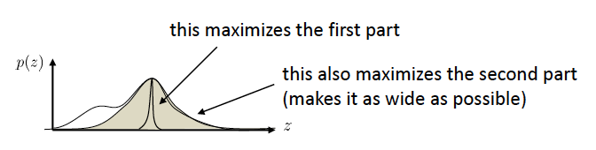
        * *Minimising $D_{\mathrm{KL}}\left(q_{i}\left(z\right) \| p\left(z \mid x_{i}\right)\right)$ w.r.t. $q_i$ is equivalent to maximising $\mathcal{L}_{i}\left(p, q_{i}\right)$!*
            * $\begin{aligned} D_{\mathrm{KL}}\left(q_{i}\left(z\right) \| p\left(z \mid x_{i}\right)\right) &=  E_{z \sim q_{i}(z)}\left[\log \frac{q_{i}(z)}{p\left(z \mid x_{i}\right)}\right] = E_{z \sim q_{i}(z)}\left[\log \frac{q_{i}(z) p\left(x_{i}\right)}{p\left(x_{i}, z\right)}\right] \\ &= -E_{z \sim q_{i}(z)}\left[\log p\left(x_{i} \mid z\right)+\log p(z)\right]+E_{z \sim q_{i}(z)}\left[\log q_{i}(z)\right]+E_{z \sim q_{i}(z)}\left[\log p\left(x_{i}\right)\right] \\ &= -\mathcal{L}_{i}\left(p, q_{i}\right)+\log p\left(x_{i}\right) \end{aligned}$
    * As $\log p_\theta(x_i) \geq \mathcal{L}_{i}\left(p, q_{i}\right)$ 
        * we can solve,  $\theta \leftarrow \arg \max _{\theta} \frac{1}{N} \sum_{i} \mathcal{L}_{i}\left(p, q_{i}\right)$ 
        * instead of $\theta \leftarrow \arg \max _{\theta} \frac{1}{N} \sum_{i} \log p_\theta(x_i)$
    * _Algorithm_:
        * for each $x_{i}$ (or mini-batch):
            * calculate $\nabla_{\theta} \mathcal{L}_{i}\left(p, q_{i}\right)$
                * sample $z \sim q_{i}\left(z\right)$
                * $\nabla_{\theta} \mathcal{L}_{i}\left(p, q_{i}\right) \approx \nabla_{\theta} \log p_{\theta}\left(x_{i} \mid z\right)$
            * $\theta \leftarrow \theta+\alpha \nabla_{\theta} \mathcal{L}_{i}\left(p, q_{i}\right)$
            * $\phi_i \leftarrow \phi_i + \alpha \nabla_{\phi_i} \mathcal{L}_{i}\left(p, q_{i}\right)$
        * Above $\phi_i$ are the parameters for $q_i$
            * $\phi_i = [\mu_i, \sigma_i]$ if $q_{i}(z)=\mathcal{N}\left(\mu_{i}, \sigma_{i}\right)$
    * _Problem_: If we use a separate $q_i$ for each sample, we'll have too many parameters!
        * Eg. if $q_{i}(z)=\mathcal{N}\left(\mu_{i}, \sigma_{i}\right)$, then there are $|\theta|+\left(\left|\mu_{i}\right|+\left|\sigma_{i}\right|\right) \times N$ parameters!
    * _Solution_: _Amortized Varitional Inference_
* **Amortised Variational Inference**
    * Train a network $q_{i}(z)=q_\phi\left(z \mid x_{i}\right) \approx p\left(z \mid x_{i}\right)$
        * Eg. $q_{\phi}(z \mid x)=\mathcal{N}\left(\mu_{\phi}(x), \sigma_{\phi}(x)\right)$
    * We thus have two networks, $p_\theta(x|z)$ for $p(x|z)$ and $q_\phi(z|x)$ for $p(z|x)$
     * **Algorithm**:
        * for each $x_{i}$ (or mini-batch):
            * calculate $\nabla_{\theta} \mathcal{L}_{i}\left(p, q_{i}\right)$
                * sample $z \sim q_{i}\left(z\right)$
                * $\nabla_{\theta} \mathcal{L}_{i}\left(p, q_{i}\right) \approx \nabla_{\theta} \log p_{\theta}\left(x_{i} \mid z\right)$
            * $\theta \leftarrow \theta+\alpha \nabla_{\theta} \mathcal{L}_{i}\left(p, q_{i}\right)$
            * $\phi \leftarrow \phi + \alpha \nabla_{\phi} \mathcal{L}_{i}\left(p, q_{i}\right)$
   * How to compute $\nabla_\phi \mathcal{L_i}$ where $\mathcal{L}_{i}=E_{z \sim q_{\phi}\left(z \mid x_{i}\right)}\left[\log p_{\theta}\left(x_{i} \mid z\right)+\log p(z)\right]+\mathcal{H}\left(q_{\phi}\left(z \mid x_{i}\right)\right)$?
        * Second term is easy: Just lookup the formula for entropy of Gaussian (assuming $q_{\phi}(z \mid x)=\mathcal{N}\left(\mu_{\phi}(x), \sigma_{\phi}(x)\right)$)
        * First term is of the form $J(\phi)=E_{z \sim q_{\phi}\left(z \mid x_{i}\right)}\left[r\left(x_{i}, z\right)\right]$ so we can use _Policy Gradients_
            * $\nabla J(\phi) \approx \frac{1}{M} \sum_{j} \nabla_{\phi} \log q_{\phi}\left(z_{j} \mid x_{i}\right) r\left(x_{i}, z_{j}\right)$
            * _Problem_: Policy Gradient has high-variance
            * _Solution_: Unlike RL where we don't know the model, here we can use the _Reparametrisation Trick_!
    * **Reparametrisation Trick**
        * With $q_{\phi}(z \mid x)=\mathcal{N}\left(\mu_{\phi}(x), \sigma_{\phi}(x)\right)$, 
            * set $z=\mu_{\phi}(x)+\epsilon \sigma_{\phi}(x)$ 
            * where $\epsilon \sim \mathcal{N}(0, 1)$
        * Now, $\begin{aligned} J(\phi) &=E_{z \sim q_{\phi}\left(z \mid x_{i}\right)}\left[r\left(x_{i}, z\right)\right] \\ &=E_{\epsilon \sim \mathcal{N}(0,1)}\left[r\left(x_{i}, \mu_{\phi}\left(x_{i}\right)+\epsilon \sigma_{\phi}\left(x_{i}\right)\right)\right] \end{aligned}$
        * Thus to estimate $\nabla_\phi J(\phi)$:
            * sample $\epsilon_{1}, \ldots, \epsilon_{M}$ from $\mathcal{N}(0,1) \quad$ (a single sample works well!)
            * $\nabla_{\phi} J(\phi) \approx \frac{1}{M} \sum_{j} \nabla_{\phi} r\left(x_{i}, \mu_{\phi}\left(x_{i}\right)+\epsilon_{j} \sigma_{\phi}\left(x_{i}\right)\right)$
    * **Another way to look at it** (the way to implement it)
        * $\begin{aligned} \mathcal{L}_{i} &= E_{z \sim q_{\phi}\left(z \mid x_{i}\right)}\left[\log p_{\theta}\left(x_{i} \mid z\right)+\log p(z)\right]+\mathcal{H}\left(q_{\phi}\left(z \mid x_{i}\right)\right) \\ &= E_{\epsilon \sim \mathcal{N}(0,1)}\left[\log p_{\theta}\left(x_{i} \mid \mu_{\phi}\left(x_{i}\right)+\epsilon \sigma_{\phi}\left(x_{i}\right)\right)\right]-D_{\mathrm{KL}}\left(q_{\phi}\left(z \mid x_{i}\right) \| p(z)\right) \\ & \approx \log p_{\theta}\left(x_{i} \mid \mu_{\phi}\left(x_{i}\right)+\epsilon \sigma_{\phi}\left(x_{i}\right)\right)-D_{\mathrm{KL}}\left(q_{\phi}\left(z \mid x_{i}\right) \| p(z)\right)\end{aligned}$
        * Second term is easy:
            * Generally $q_{\phi}\left(z \mid x_{i}\right)$ and $p(z)$ have a simple form (eg. Gaussian) 
            * and $D_{\mathrm{KL}}\left(q_{\phi}\left(z \mid x_{i}\right) \| p(z)\right)$ has a convenient analytical form.
            * So can simply compute its gradient using autodiff.
        * First term is harder and requires the _Reparamtrisation Trick_ and is and is generally approximated with a single sample.
    * _Architecture_: 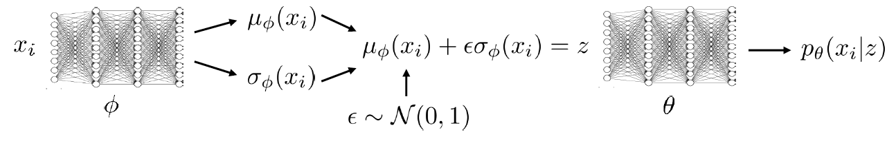
    * **Reparameterization trick vs. policy gradient**
        * Policy gradient 		$\nabla J(\phi) \approx \frac{1}{M} \sum_{j} \nabla_{\phi} \log q_{\phi}\left(z_{j} \mid x_{i}\right) r\left(x_{i}, z_{j}\right)$
            * (+) Can handle both discrete and continuous latent variables
            * (-) High variance, requires multiple samples & small learning rates
        * Reparameterization trick 		$\nabla_{\phi} J(\phi) \approx \frac{1}{M} \sum_{j} \nabla_{\phi} r\left(x_{i}, \mu_{\phi}\left(x_{i}\right)+\epsilon_{j} \sigma_{\phi}\left(x_{i}\right)\right)$
            * (+) Very simple to implement
            * (+) Low variance
            * (-) Only continuous latent variables
* **Variational Autoencoder** 
    * 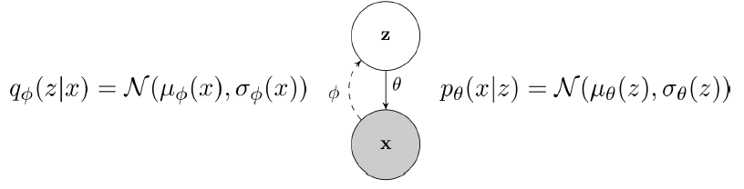
    * _training_: $\max _{\theta, \phi} \frac{1}{N} \sum_{i} \log p_{\theta}\left(x_{i} \mid \mu_{\phi}\left(x_{i}\right)+\epsilon \sigma_{\phi}\left(x_{i}\right)\right)-D_{\mathrm{KL}}\left(q_{\phi}\left(z \mid x_{i}\right) \| p(z)\right)$
        * First term: Autoencoder objective
        * Second term: Encoder should encode the observations $x_i$ into latent distributions that are similar to the prior ($p(z)$)
    * 
    * _sampling_:
        * $\begin{aligned} z &\sim p(z) \\ x &\sim p(x \mid z) \end{aligned}$
        * Why does sampling work?
            * $\mathcal{L}_{i}=E_{z \sim q_{\phi}\left(z \mid x_{i}\right)}\left[\log p_{\theta}\left(x_{i} \mid z\right)\right]-D_{\mathrm{KL}}\left(q_{\phi}\left(z \mid x_{i}\right) \| p(z)\right)$
            * The second term in the objective forces $q_\phi$ to embed $x_i$ into $z$ with distribution close to the prior $p(z)$ so if we sample $z \sim p(z)$, then $x \sim p(x \mid z)$ should give $x$ that look like the data.